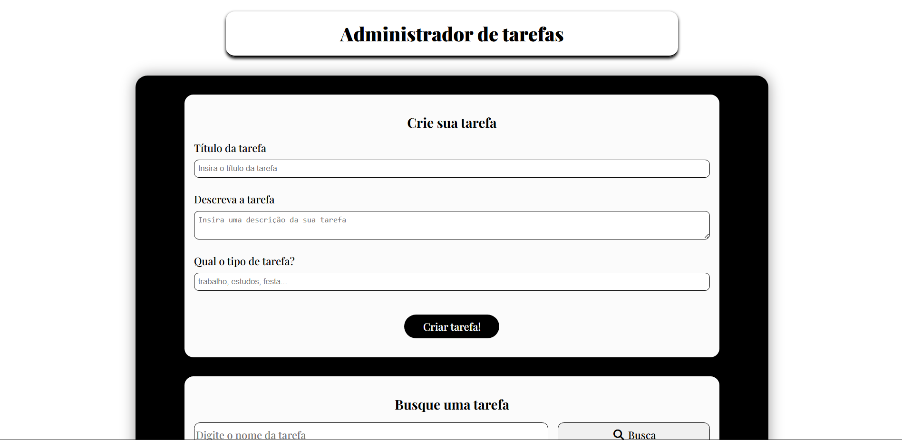
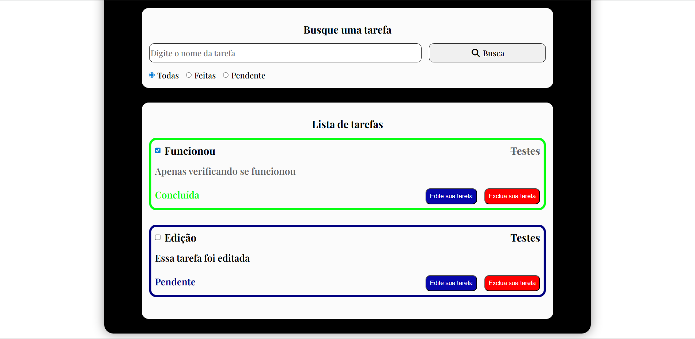
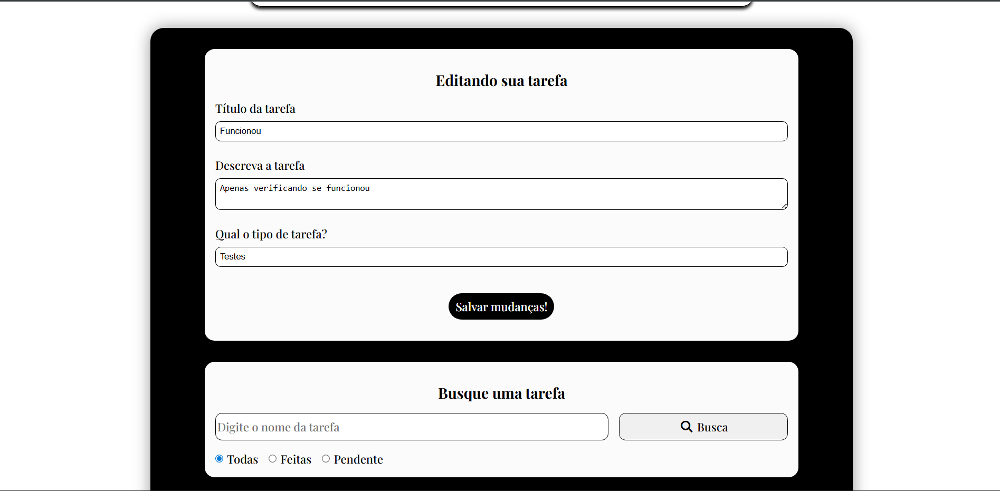
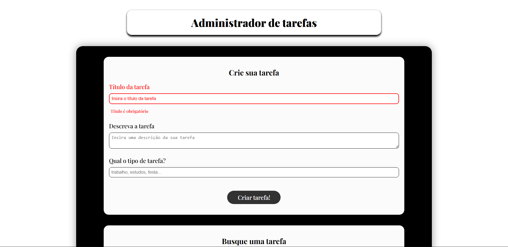

# 📝 Administrador de Tarefas (To-Do List)

Aplicação de gerenciamento de tarefas desenvolvida com JavaScript puro, permitindo criar, editar, excluir e organizar tarefas com filtros e busca.

---

## 🚀 Funcionalidades

* ✅ Criar tarefas
* ✏️ Editar tarefas
* 🗑️ Excluir tarefas
* ✔️ Marcar como concluída ou pendente
* 🔍 Busca por título
* 🎯 Filtro por status (todas, pendentes, concluídas)
* 💾 Persistência com localStorage
* 📱 Layout responsivo (mobile e desktop)
* ⚠️ Validação de formulário (título obrigatório com feedback visual)

---

## 🖼️ Preview

### 🏠 Tela principal



### 🔍 Busca e filtro



### ✏️ Edição de tarefa



### ⚠️ Validação de formulário



---

## 🛠️ Tecnologias utilizadas

* HTML
* CSS
* JavaScript (Vanilla JS)

---

## 🎯 Objetivo do projeto

Este projeto foi desenvolvido com o objetivo de praticar:

* Manipulação de DOM
* Eventos em JavaScript
* Lógica de CRUD
* Filtragem e busca de dados
* Armazenamento no navegador (localStorage)
* Responsividade
* Boas práticas de UX

---

## 📂 Como executar

Abra o link da Demo: https://leozanidev.github.io/todo-list/

OU

1. Clone o repositório:

```bash
git clone LINK_DO_REPOSITORIO
```

2. Abra o arquivo `index.html` no navegador

---

## 📌 Melhorias futuras

* Mensagem quando não houver tarefas
* Animações de interação
* Ordenação de tarefas
* Melhorias de acessibilidade

---

## 👨‍💻 Autor

Desenvolvido por Leonardo Zani de Souza
